# 45Flow User Guide

Welcome to **45Flow** — the secure file sharing and collaboration platform by 45Drives. This guide walks you through installing the application, connecting to your server, and using every feature from start to finish.

---

## Table of Contents

1. [System Requirements](#1-system-requirements)
2. [Installation](#2-installation)
   - [macOS](#macos)
   - [Windows](#windows)
   - [Linux](#linux)
3. [Getting Started — Connecting to Your Server](#3-getting-started--connecting-to-your-server)
   - [Automatic Server Discovery](#automatic-server-discovery)
   - [Manual Connection via IP](#manual-connection-via-ip)
   - [Custom Port Configuration](#custom-port-configuration)
   - [Logging In](#logging-in)
4. [Dashboard Overview](#4-dashboard-overview)
5. [Drag and Drop QuickShare](#5-drag-and-drop-quickshare)
6. [Share Files Remotely (Generate a Share Link)](#6-share-files-remotely-generate-a-share-link)
   - [Step 1: Select a Project](#step-1-select-a-project)
   - [Step 2: Select Files & Configure Link](#step-2-select-files--configure-link)
   - [Link Access Modes](#link-access-modes)
   - [Advanced Video Options](#advanced-video-options)
   - [Generating the Link](#generating-the-link)
7. [Upload Files Locally](#7-upload-files-locally)
   - [Step 1: Select Local Files](#step-1-select-local-files)
   - [Step 2: Choose Destination](#step-2-choose-destination)
   - [Step 3: Upload & Monitor Progress](#step-3-upload--monitor-progress)
8. [Create an Upload Link (Remote Upload)](#8-create-an-upload-link-remote-upload)
   - [Selecting a Destination Folder](#selecting-a-destination-folder)
   - [Configuring the Upload Link](#configuring-the-upload-link)
   - [Generating the Upload Link](#generating-the-upload-link)
9. [Managing Links](#9-managing-links)
   - [Searching & Filtering Links](#searching--filtering-links)
   - [Link Table Columns](#link-table-columns)
   - [Link Actions](#link-actions)
10. [Link Details](#10-link-details)
   - [Link Configuration Summary](#link-configuration-summary)
   - [Shared Files](#shared-files)
   - [Access Activity Log](#access-activity-log)
   - [File Versions](#file-versions)
11. [Editing a Link](#11-editing-a-link)
12. [Video Player & Comments](#12-video-player--comments)
    - [Playback Controls](#playback-controls)
    - [Quality Selection](#quality-selection)
    - [Timecoded Comments](#timecoded-comments)
13. [User Management](#13-user-management)
    - [Viewing Existing Users](#viewing-existing-users)
    - [Creating a New User](#creating-a-new-user)
    - [Editing & Deleting Users](#editing--deleting-users)
14. [Role Management](#14-role-management)
    - [System Roles](#system-roles)
    - [Creating Custom Roles](#creating-custom-roles)
    - [Editing & Deleting Roles](#editing--deleting-roles)
15. [Settings](#15-settings)
    - [Default Link Access](#default-link-access)
    - [External Share URL (Public)](#external-share-url-public)
    - [Internal Share URL (LAN / VPN)](#internal-share-url-lan--vpn)
    - [Project Root](#project-root)
    - [Default Link Options](#default-link-options)
    - [Maintenance & Cleanup](#maintenance--cleanup)
16. [Upgrade to Pro Edition](#16-upgrade-to-pro-edition)
    - [Purchasing a License](#purchasing-a-license)
    - [Activating Your License](#activating-your-license)
    - [Downloading & Installing Pro Edition](#downloading--installing-pro-edition)
17. [View Logs (Client Log Viewer)](#17-view-logs-client-log-viewer)
    - [Log Summary](#log-summary)
    - [Searching & Filtering Logs](#searching--filtering-logs)
    - [Log Entry Details](#log-entry-details)
18. [Port Forwarding for External Sharing](#18-port-forwarding-for-external-sharing)
19. [Frequently Asked Questions](#19-frequently-asked-questions)

---

## 1. System Requirements

| Platform | Requirement |
|----------|-------------|
| **macOS** | macOS 10.15 (Catalina) or later, Intel or Apple Silicon |
| **Windows** | Windows 10 or later (64-bit) |
| **Linux** | Ubuntu 20.04+ (DEB) or Rocky/RHEL 8+ (RPM) |
| **Network** | LAN access to your 45Drives server. For external sharing, HTTPS port 443 must be forwarded from your router. |

---

## 2. Installation

Download the latest version of 45Flow from the **[Releases page](https://github.com/45Drives/studio-share/releases)**. Under the **Assets** section of the latest release, download the file matching your operating system.

### macOS

| Chip | File to Download |
|------|-----------------|
| Apple Silicon (M1, M2, M3, M4…) | `*-mac-arm64.dmg` |
| Intel | `*-mac-x64.dmg` |

1. Double-click the downloaded `.dmg` file.
2. In the window that appears, drag the **45Flow** icon into the **Applications** folder.
3. Open **45Flow** from your Applications folder or Launchpad.

> **Tip:** If macOS warns the app is from an unidentified developer, go to **System Preferences → Security & Privacy** and click **Open Anyway**.

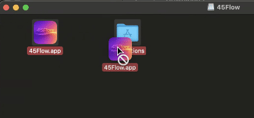

### Windows

| File to Download |
|-----------------|
| `*-win-x64.exe` |

1. Double-click the downloaded `.exe` installer.
2. Follow the on-screen installation wizard steps.
3. Once complete, launch **45Flow** from the Start Menu or Desktop shortcut.

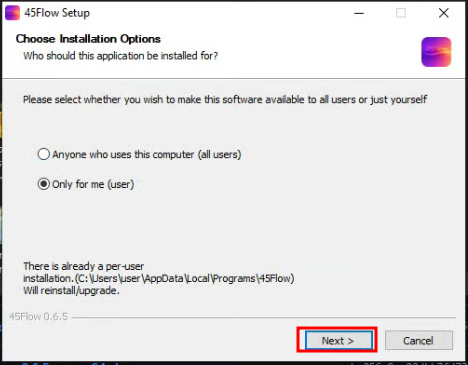

### Linux

| Distribution | File to Download | Install Command |
|-------------|-----------------|-----------------|
| Ubuntu / Debian | `*-linux-amd64.deb` | `sudo apt install ./45flow-*-linux-amd64.deb` |
| Rocky / RHEL | `*-linux-x86_64.rpm` | `sudo dnf install ./45flow-*-linux-x86_64.rpm` |

1. Download the appropriate package file.
2. Open a terminal and run the install command above, replacing the filename as needed.
3. Launch **45Flow** from your application menu.

---

## 3. Getting Started — Connecting to Your Server

When you first open 45Flow, you'll see the **Login Screen**. This is where you connect the desktop client to your 45Drives server.

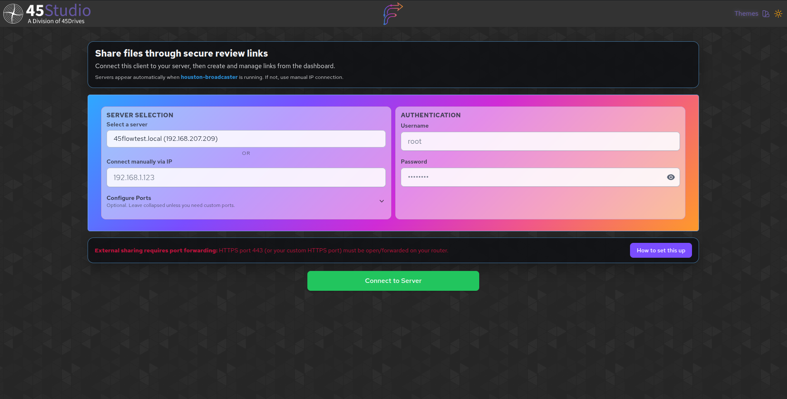

### Automatic Server Discovery

If your server is running the **houston-broadcaster** service on the same network, it will appear automatically in the **"Select a server"** dropdown. Each entry shows the server's hostname and IP address.

Simply select your server from the dropdown to populate the connection.

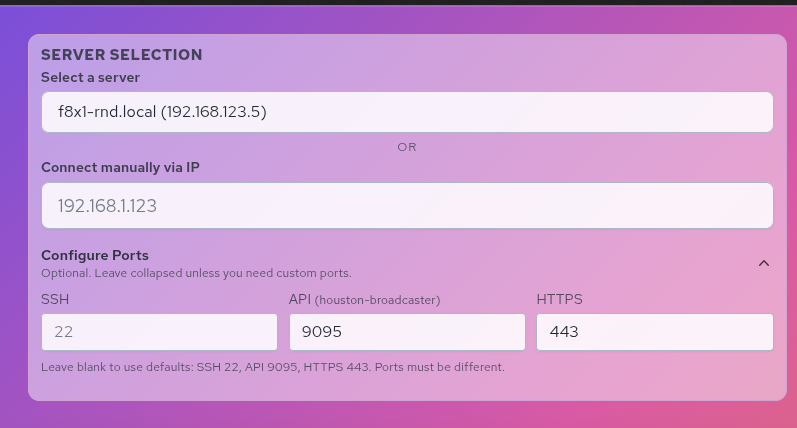

> **Note:** If no servers appear, the houston-broadcaster service may not be running, or you may be on a different subnet. Use the manual connection method below.

### Manual Connection via IP

If your server doesn't appear automatically:

1. Find the **"Connect manually via IP"** field.
2. Enter your server's IP address (e.g., `192.168.1.123`).

### Custom Port Configuration

In most cases, the default ports work without changes. If your server uses non-standard ports, click **"Configure Ports"** to expand the port settings:

| Port | Default | Purpose |
|------|---------|---------|
| **SSH** | 22 | Secure shell communication |
| **API** | 9095 | Server communication and link management |
| **HTTPS** | 443 | Share links, upload links, external access |

> **Important:** For external sharing the HTTPS port (443 by default) must be open/forwarded on your router. See [Port Forwarding](#17-port-forwarding-for-external-sharing) for details.

### Logging In

1. Enter your server **Username** (e.g., `root`).
2. Enter your **Password**.
3. Click **"Connect to Server"**.

The app will display status messages as it connects:
- *"Preparing SSH…"*
- *"Bootstrapping…"*
- *"Checking server health…"*

On success, you'll be taken to the **Dashboard**.

---

## 4. Dashboard Overview

The **Dashboard** (also called the **Control Center**) is your central hub for managing all file sharing operations.

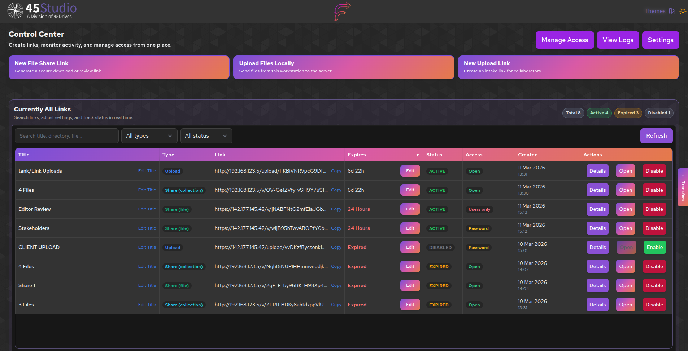

### Top Navigation

At the top of the Dashboard, you'll find quick-access buttons:

| Button | Description |
|--------|-------------|
| **Manage Users** | Open user management to create accounts, assign roles, and manage access |
| **View Logs** | Open the log viewer to inspect application activity and diagnose issues |
| **Settings** | Configure application-wide defaults for links, URLs, and server behavior |

### Main Action Buttons

Three large action buttons let you perform the core tasks:

| Button | Description |
|--------|-------------|
| **New File Share Link** | Generate a secure link for others to view, download, or comment on your files |
| **Upload Files Locally** | Transfer files from your workstation directly to the server |
| **New Upload Link** | Create a link that allows external collaborators to upload files to your server |

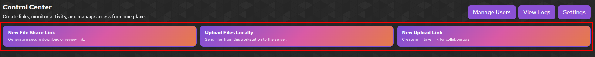

### Active Links Table

Below the action buttons, the Dashboard displays a table of **all links** you've created, with search/filter tools and at-a-glance status information. See [Managing Links](#9-managing-links) for full details.

### Logging Out

Click **"Log Out"** at the bottom of the Dashboard to disconnect from the server and return to the Login Screen.

---

## 5. Drag and Drop QuickShare

The **QuickShare** feature provides the fastest way to create a share link. Simply drag files from your desktop or file manager directly into 45Flow to instantly generate a shareable link with one click.

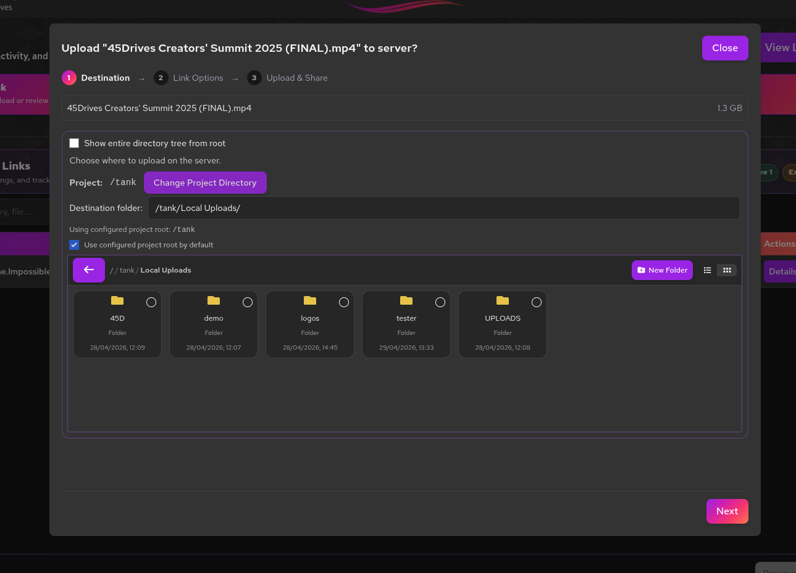

### How to Use QuickShare

1. **Drag Files:** From anywhere on your computer, drag one or more files directly into the QuickShare drop zone.
2. **Files Upload:** The selected files are automatically uploaded to your server.
3. **One-Click Share:** Once uploaded, click the **"QuickShare"** button to instantly generate a shareable link with default settings.

### QuickShare Link Settings

QuickShare links are created with the following default settings:

- **Expiration:** 7 days from creation
- **Access Mode:** Anyone with the link (no password required)
- **Network:** Local network access (LAN/VPN)
- **Comments:** Enabled by default

These defaults can be customized in [Settings](#15-settings) under **Default Link Options**.

### After Creating a QuickShare Link

Once generated, the share link is:
- **Automatically copied to your clipboard** — ready to paste into email, chat, or wherever you need
- **Displayed on screen** — for immediate viewing and verification
- **Added to your Active Links table** on the Dashboard for management

From the Dashboard, you can find your QuickShare link and:
- Edit settings (change expiration, access mode, etc.)
- Copy the link again
- View access logs
- Delete the link

> **Tip:** QuickShare is perfect for ad-hoc file sharing when you don't need custom settings. For more control over link configuration, use the [full file share workflow](#6-share-files-remotely-generate-a-share-link) instead.

---

## 6. Share Files Remotely (Generate a Share Link)

Use this feature to select files on your server and generate a secure link that others can use to view, download, and optionally comment on those files.

Click **"New File Share Link"** from the Dashboard to begin.

### Step 1: Select a Project

First, choose the storage location where your files reside.

- The screen displays your available **ZFS pools** (storage locations) such as `/media`, `/projects`, etc.
- Click **"Select"** next to the pool you want to use.
- Alternatively, check **"Show entire directory tree from root"** to browse the full filesystem.

> **Tip:** You can set a default project root in **Settings → Project Root** to skip this step for future links.

Click **"Return to Dashboard"** at any time to cancel.

### Step 2: Select Files & Configure Link

After choosing a project, you'll see the file selection and link configuration screen.

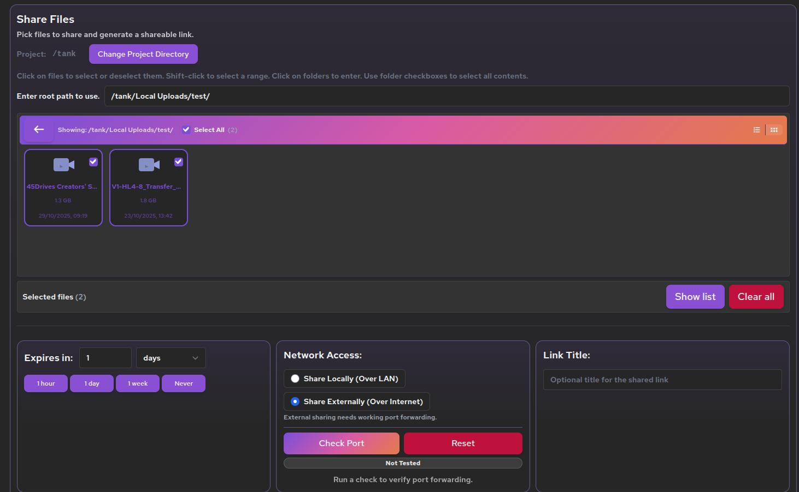

#### Selecting Files

- Use the **file browser** to navigate folders and select individual files or entire folders.
- Selected files appear in the **"Selected files"** panel with a count badge.
- Click **"Show list"** to review your selection, and use the **✕** button to remove individual files.
- Click **"Clear all"** to start over.

#### Configuring the Link

**Expiration:**
- Set how long the link stays active using the **"Expires in"** field.
- Use the number and time unit (hours, days, weeks) or choose a quick preset: **1 hour**, **1 day**, **1 week**, or **Never**.
- Once expired, the link becomes inaccessible automatically.

**Network Access:**
- **Share Locally (Over LAN)** — Link accessible only within your local network or VPN.
- **Share Externally (Over Internet)** — Link accessible from anywhere. Requires port forwarding to be configured.
- Use the **"Check Port"** button to verify your external port forwarding is working.

**Link Title** (optional):
- Give the link an internal name to help you identify it later on the Dashboard.

### Link Access Modes

Choose who can access the link:

| Mode | Description |
|------|-------------|
| **Anyone with the link** | No login required. Anyone with the URL can access the files. You can optionally enable the **"Allow comments"** toggle so visitors can leave a name and comment. |
| **Anyone with the link + password** | Requires a shared password. Enter a password in the field that appears. The same password is used by all recipients. |
| **Only invited users** | Requires each user to log in with their own credentials. Click **"Invite users…"** to select which users can access. Permissions are controlled by their assigned roles. |

### Advanced Video Options

When sharing video files, expand the **"Advanced video options"** section for additional controls:

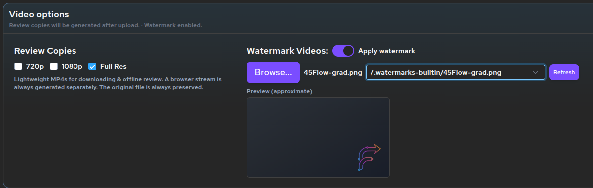

**Use Review Copies:**
- When enabled, the system generates lower-resolution review copy versions of your videos (720p, 1080p).
- Shared links serve the review copies instead of the originals, providing faster playback and reduced bandwidth.
- Select which qualities to generate: **720p**, **1080p**, **Original**, or any combination.

**Watermark Videos:**
- When review copies are enabled, you can also apply a watermark overlay.
- Click **"Choose Image"** to upload a watermark image, or select an existing one from the dropdown.
- A preview shows the approximate watermark placement.
- Useful for protecting intellectual property or branding shared content.

### Generating the Link

1. Verify all your settings are correct.
2. Click **"Generate Flow link"**.
3. The generated URL will appear — use the **"Copy"** button to copy it to your clipboard, or **"Open"** to view it in your browser.
4. The link is now visible on your Dashboard for ongoing management.

---

## 7. Upload Files Locally

Use this feature to transfer files from your workstation directly to the server. This is ideal for getting new media onto the server for sharing later.

Click **"Upload Files Locally"** from the Dashboard to begin. A three-step wizard will guide you through the process.

### Step 1: Select Local Files

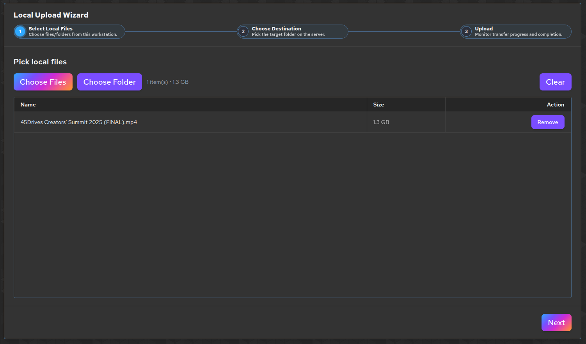

1. Click **"Choose Files"** to select individual files, or **"Choose Folder"** to add an entire folder's contents.
2. Selected files appear in a table showing **Name**, **Size**, and a **Remove** button.
3. A summary shows the total number of items and combined size.
4. Use **"Clear"** to remove all selected files and start over.
5. Click **"Next"** to proceed.

> **Note:** You can select multiple files at once in the file chooser dialog.

### Step 2: Choose Destination

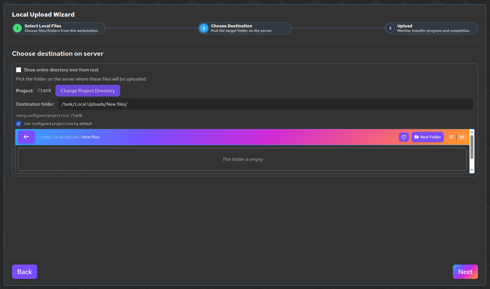

1. Select a **ZFS pool** (storage location) or check **"Show entire directory tree from root"** for full filesystem access.
2. Navigate the folder browser:
   - **Single-click** a folder to select it as the destination.
   - **Double-click** a folder to enter it and browse deeper.
   - Click **"New Folder"** to create a new directory at the current location.
3. The selected destination path is shown at the top.
4. Click **"Change Project Directory"** to go back and select a different pool.
5. Click **"Next"** to proceed, or **"Back"** to return to file selection.

### Step 3: Upload & Monitor Progress

**Before Uploading:**

If you're uploading video files, you can configure **Advanced Video Options** before starting:

- **Use Review Copies** — Enable to generate review copy versions (720p, 1080p) of your videos during upload. These review copies are used when you share the files later via links.
- **Watermark Videos** — Apply a watermark overlay to uploaded videos for later sharing.

Click **"Start Upload"** to begin transferring files.

**During Upload:**

The upload table shows each file with real-time status:

| Column | Description |
|--------|-------------|
| **Name** | File name with upload percentage |
| **Size** | File size |
| **Speed / Time** | Transfer speed during upload, or total time after completion |
| **Status** | Current state — **Queued**, **Uploading**, **Done**, **Canceled**, or **Error** |
| **Action** | Cancel button (available during active upload) |

A progress bar at the top shows overall completion across all files.

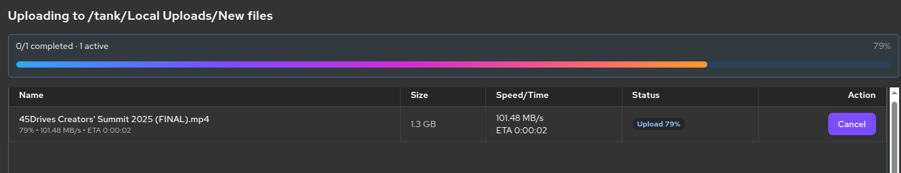

**After Upload:**

When all files are complete, click **"Finish"** to return to the Dashboard.

> **Tip:** If any uploads fail, the error message will appear below the file entry. You can address the issue and re-upload those files.

---

## 8. Create an Upload Link (Remote Upload)

Use this feature to create a link that allows external collaborators to upload files to a specific folder on your server — without giving them Dashboard access.

Click **"New Upload Link"** from the Dashboard to begin.

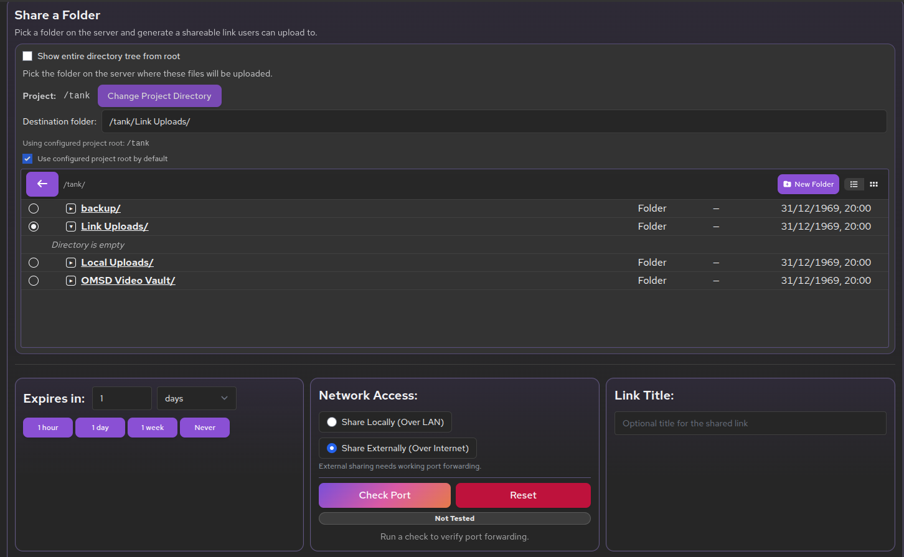

### Selecting a Destination Folder

1. Select a **ZFS pool** or browse the full directory tree.
2. Navigate the folder browser to choose where uploaded files should be stored:
   - **Single-click** to select a folder.
   - **Double-click** to enter a folder.
   - **New Folder** to create a new directory.

### Configuring the Upload Link

**Expiration:**
- Use the **"Expires in"** field with a number and time unit (hours, days, weeks), or choose a preset: **1 hour**, **1 day**, **1 week**, or **Never**.
- Once expired, no further uploads are allowed through the link.

**Network Access:**
- **Share Locally (Over LAN)** — Link only works within your local network.
- **Share Externally (Over Internet)** — Link accessible from anywhere (requires port forwarding).

**Link Title** (optional):
- Name the link for easy identification on the Dashboard.

**Link Access Mode:**

| Mode | Description |
|------|-------------|
| **Anyone with the link** | No login required. **⚠️ Warning:** Anyone with the link can upload files to your server. Use only in trusted scenarios. |
| **Anyone with the link + password** | Requires a shared password before uploading. |
| **Only invited users** | Users must log in with their credentials before uploading. Click **"Invite users…"** to add authorized users. |

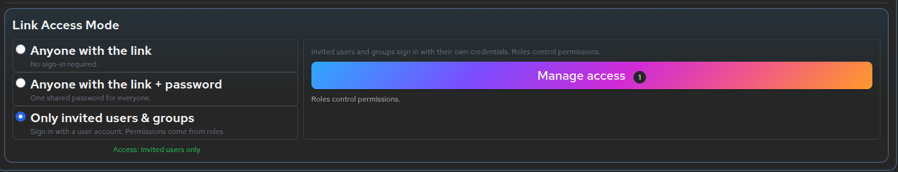

### Generating the Upload Link

1. Ensure a destination folder is selected and all settings are configured.
2. Click **"Generate Flow link"**.
3. Copy or open the generated URL to share with your collaborators.

When someone opens the link, they'll see a drag-and-drop upload page where they can send files directly to the specified folder.

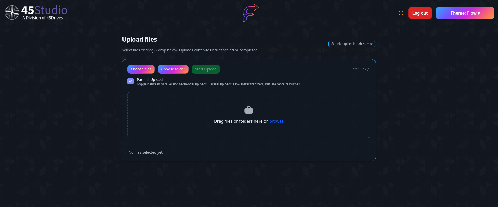

---

## 9. Managing Links

All links you create — both share and upload — appear on the Dashboard in the **links table**. This is your central view for monitoring and managing all active, expired, and disabled links.

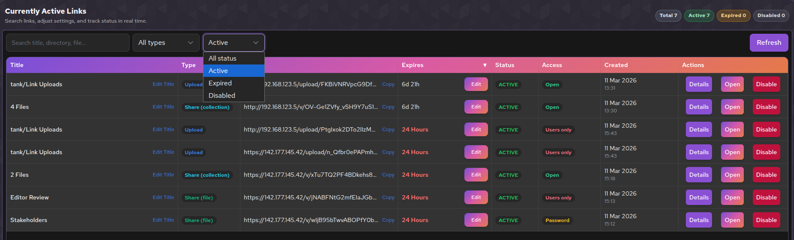

### Searching & Filtering Links

At the top of the table:

- **Search bar** — Filter links by title, directory, or file name. Results update as you type.
- **Type filter** — Show only specific link types: *All types*, *Upload*, *Share (file)*, or *Share (collection)*.
- **Status filter** — Show only links with a specific status: *All status*, *Active*, *Expired*, or *Disabled*.
- **Refresh** — Manually reload the link list from the server.

Summary badges show the count of **Total**, **Active**, **Expired**, and **Disabled** links.

### Link Table Columns

| Column | Description |
|--------|-------------|
| **Title** | Internal name of the link. Click the edit icon to rename it inline. Click the title to open Link Details. |
| **Type** | Badge showing **Upload**, **Share (file)**, or **Share (collection)**. |
| **Link** | The public URL. Click to open in browser, or use the **Copy** button. |
| **Expires** | Time remaining (e.g., *23 Hours*, *6d 22h*, *Never*). Shown in red when less than 24 hours remain. Click **Edit** to change the expiration. |
| **Status** | Current state: **ACTIVE** (green), **EXPIRED** (amber), or **DISABLED** (gray). |
| **Access** | Access mode: **Open** (green), **Password** (amber), or **Users only** (rose). Hover for details. |
| **Created** | Date and time the link was created. |
| **Actions** | Action buttons (see below). |

### Link Actions

Each link row provides these actions:

| Action | Description |
|--------|-------------|
| **Details** | Opens the full Link Details view with configuration, activity log, and file list. |
| **Open** | Opens the link in your browser to preview what recipients will see. |
| **Disable / Enable** | Immediately deactivates or reactivates the link. Disabling blocks access without deleting the link. |

---

## 10. Link Details

Click **"Details"** on any link (or click its title) to view comprehensive information.

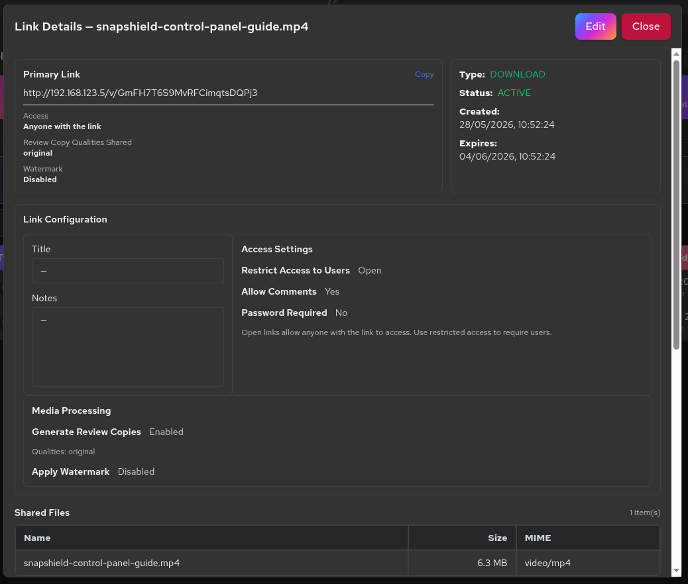

### Link Configuration Summary

The details view displays:

| Field | Description |
|-------|-------------|
| **Primary Link** | The full URL with a **Copy** button. |
| **Access** | Current access mode (Open / Password / Users only). |
| **Review Copies** | Whether review copy generation is enabled or disabled. |
| **Watermark** | Whether watermarking is enabled or disabled. |
| **Type** | Share (download) or Upload. |
| **Status** | Active, Expired, or Disabled. |
| **Created** | Creation date and time. |
| **Expires** | Expiration date/time or "Never". |
| **Title** | Internal name. |
| **Notes** | Optional internal notes. |

### Shared Files

A table of all files associated with this link, showing:
- **Name** — File name
- **Size** — File size
- **MIME** — File type (e.g., video/mp4, image/jpeg)

### Access Activity Log

View a log of all actions taken on this link:

| Column | Description |
|--------|-------------|
| **When** | Date and time of the activity. |
| **Action** | What happened — e.g., *Playback requested*, *Download*, *Upload*, *Expiry updated*. |
| **Actor** | Whether the access was from a *Guest* or an *Authenticated user*. |
| **Source** | IP address and browser information. |
| **Summary** | Details of the action performed. |

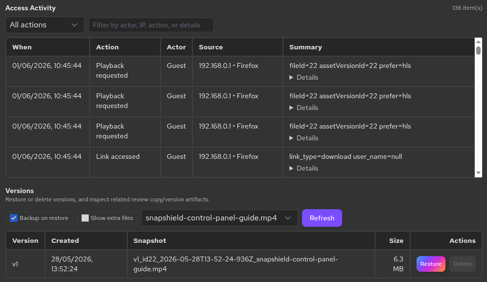

### File Versions

If file versioning/snapshots are available, this section shows:

| Column | Description |
|--------|-------------|
| **Version** | Version identifier (e.g., v1, v2). |
| **Created** | When the version was created. |
| **Snapshot** | Snapshot reference. |
| **Size** | File size at that version. |
| **Restore** | Restore this version, replacing the current file. |
| **Delete** | Remove this version (if permitted). |

Click **"Edit"** at the top of the Link Details view to modify the link's settings (see next section).

---

## 11. Editing a Link

From the Link Details view, click **"Edit"** to modify an existing link's configuration.

You can modify:

- **Title** and **Notes** — Update the internal name and documentation.
- **Restrict Access to Users** — Toggle between open and restricted access.
- **Allow Comments** — Enable or disable commenting on shared files.
- **Password Required** — Enable or disable password protection, and set the password.
- **Generate Review Copies** — Enable/disable review copy generation and select qualities (720p, 1080p, Original).
- **Apply Watermark** — Enable/disable watermark overlay and choose or upload a watermark image.
- **Files for This Link** — Add or remove files associated with the link using **"Manage Files"**.

Click **"Save Changes"** to apply. All changes take effect **immediately**.

Click **"Cancel"** or **"Close"** to discard changes and return to Link Details.

> **Important:** Changes to access settings, passwords, and file lists take effect immediately for anyone accessing the link.

---

## 12. Video Player & Comments

When someone opens a share link containing video files, they see the **45Flow Video Player** — a browser-based player with collaboration features.

### Playback Controls

The player supports standard media controls:
- **Play / Pause**
- **Seek bar** with timeline scrubbing
- **Volume control**
- **Fullscreen** toggle
- **Playback rate** adjustment (speed up or slow down)

### Quality Selection

If review copies were generated, viewers can choose their preferred quality:
- **Auto** — Automatically adapts to available bandwidth
- **720p** — Lower resolution, faster loading
- **1080p** — Full HD
- **Original** — Full quality source file (if included)

The player uses **HLS (HTTP Live Streaming)** for adaptive bitrate delivery.

### Timecoded Comments

If comments are enabled on the link, a **Comments Panel** appears alongside the player:

- **Viewing comments:** Comments are displayed with the author's name, timecode, and color-coded indicator. Click a timecode to jump to that point in the video.
- **Adding comments:** Click the comment input area, type your message, and submit. The comment is automatically tagged to the current playback position.
- **Replies:** Click on any comment to reply, creating threaded conversations.
- **Timecode markers:** Visual markers appear on the seek bar indicating where comments exist.
- **SMPTE timecodes:** Comments display professional SMPTE timecodes (HH:MM:SS:FF) when the video's frame rate is detected.

> **Note:** Commenting availability depends on the link's access mode and whether comments were enabled when creating the link.

#### Multi-File Shares

For collection links (multiple files), a sidebar file browser appears on the left. Click any file to load it in the player. Version selection is available if multiple versions exist.

---

## 13. User Management

Users are required for the **"Only invited users"** access mode and allow role-based permissions on restricted links. Access user management from the Dashboard by clicking **"Manage Users"**.

### Viewing Existing Users

The top section lists all currently created users with:
- **Name** and **Username**
- **Email** (if provided)
- **Company** and **Tags** (if provided)
- **Assigned role**
- **Color dot** indicating their comment color

Use the **search bar** to filter users by name, username, email, company, or tags.

### Creating a New User

Click **"Create new user"** to expand the creation form.

| Field | Required | Description |
|-------|----------|-------------|
| **Name** | Yes | Display name shown in comments and activity logs. |
| **Username** | Yes | Login identifier. Must be unique. |
| **Temporary Password** | Yes | Initial password (4–64 characters). Click **"Generate password"** to auto-generate one. Share this securely with the user. |
| **Confirm Password** | Yes | Must match the temporary password. |
| **Email** | No | Email address for identification. |
| **Company** | No | Company affiliation. |
| **Tags** | No | Comma-separated tags (e.g., `finance, vip, internal`). |
| **Default Role** | — | The role automatically assigned when this user is added to restricted links. |
| **Comment Color** | — | Hex color used to visually distinguish this user's comments. Use the color picker or type a hex value (e.g., `#94ebc8`). |

Click **"Create User"** to save. The user will appear in the existing users list and can now be invited to restricted links.

### Editing & Deleting Users

- Click the **pencil icon** on any user to edit their name, email, company, tags, comment color, default role, or to reset their password.
- Click the **red X** to delete a user. A confirmation dialog will appear — **this action cannot be undone**.

---

## 14. Role Management

Roles define what users can do when accessing restricted links. Access role management from **Manage Users → Manage Roles**.

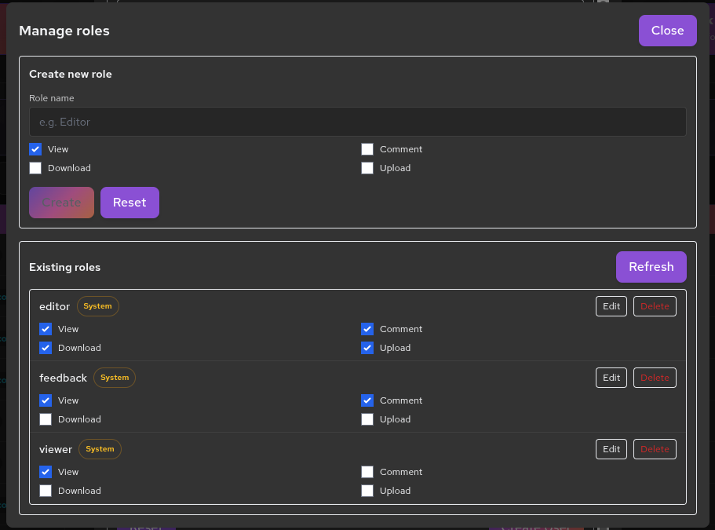

### System Roles

45Flow includes three built-in roles that cannot be deleted:

| Role | View | Comment | Download | Upload |
|------|------|---------|----------|--------|
| **Editor** | ✅ | ✅ | ✅ | ✅ |
| **Feedback** | ✅ | ✅ | ✅ | ❌ |
| **Viewer** | ✅ | ❌ | ❌ | ❌ |

### Permission Definitions

| Permission | What It Allows |
|------------|----------------|
| **View** | See files, open media, browse directory contents |
| **Comment** | Leave timecoded comments and participate in threads |
| **Download** | Download files to their device |
| **Upload** | Upload files (on upload-enabled links) |

### Creating Custom Roles

1. Enter a **Role name** (e.g., "Client", "Uploader").
2. Check the permissions you want to grant.
3. Click **"Create"**.

### Editing & Deleting Roles

- Click **Edit** on any custom role to modify its name or permissions, then click **Save**.
- Click **Delete** to remove a custom role (only if it's not currently assigned to users).
- System roles (Editor, Feedback, Viewer) cannot be deleted or modified.

> **Important:** Role changes apply immediately to all users assigned that role. Removing a permission instantly restricts affected users.

---

## 15. Settings

Configure application-wide defaults and server settings. Access Settings from the Dashboard by clicking **"Settings"**.

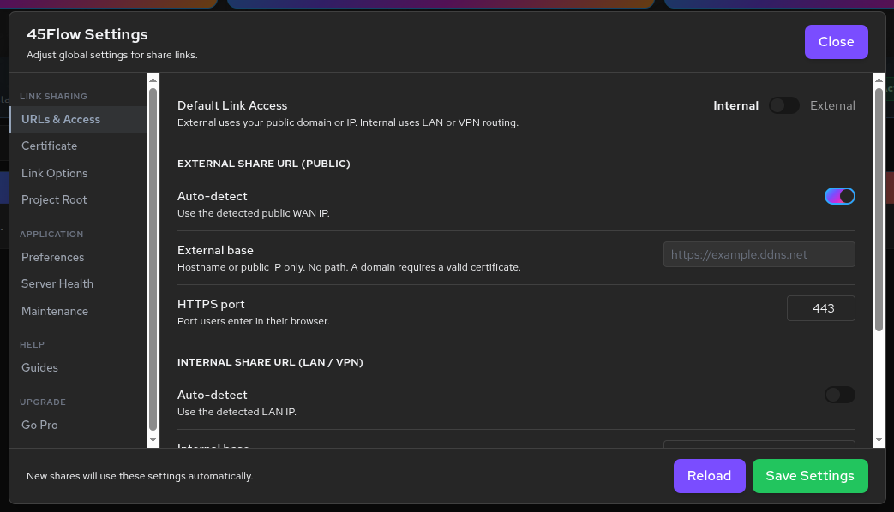

### Default Link Access

Toggle between **Internal** and **External** as the default network access mode for new links:

- **Internal** — New links default to LAN/VPN routing.
- **External** — New links default to public/internet routing (requires port forwarding).

### External Share URL (Public)

Configure how public-facing links are generated:

| Setting | Description |
|---------|-------------|
| **Auto-detect (WAN IP)** | Enable to automatically detect and use your public IP address. Disable to enter a custom domain. |
| **External base** | Your public hostname or IP (e.g., `https://example.ddns.net`). No path — hostname only. |
| **External HTTPS port** | Port users will use in their browser. Default is `443`. |

> **Note:** Using a custom domain requires a valid SSL certificate for that domain.

**Example:**  
Without a domain: `https://142.177.145.42/s/<token>`  
With a domain: `https://studio.yourcompany.com/s/<token>`

### Internal Share URL (LAN / VPN)

Configure how internal links are generated:

| Setting | Description |
|---------|-------------|
| **Auto-detect (LAN IP)** | Enable to automatically detect and use your local server IP. |
| **Internal base** | Private IP or internal hostname (e.g., `http://192.168.1.123`). |

A **Preview** section shows the currently active external and internal URLs so you can verify your configuration.

### Project Root

| Setting | Description |
|---------|-------------|
| **Ignore ZFS pools** | Check to skip the pool selection step and always use the configured project root. |
| **Project root path** | Absolute path used as the default starting directory when creating shares or uploads. |

### Default Link Options

These defaults are applied automatically when creating new links, but can be changed per link:

| Option | Description |
|--------|-------------|
| **Restrict access to users** | New links default to restricted (invited users only) mode. |
| **Allow comments on open links** | Enable comments by default on open (unauthenticated) links. |
| **Generate review copies by default** | Automatically enable review copy generation for new links. |

### Maintenance & Cleanup

For administrators to manage server health:

- **Delete orphan transcode directories** — Remove transcode output folders that no longer have associated links.
- **Prune DB rows for missing source files** — Clean up database entries where the original files no longer exist on disk.
- Configure **orphan min age** (hours) and **max missing file checks** to control scan scope.
- Click **"Run Scan"** to preview what would be cleaned, then **"Apply Cleanup"** to execute.
- Use **"Export JSON"** to save scan results.

### Saving Settings

- Click **"Save settings"** to apply all changes. New links will use the updated defaults.
- Click **"Reload"** to discard changes and reload current settings from the server.

> **Important:** Settings changes affect only **newly created links**. Existing links are not modified retroactively.

---

## 16. Upgrade to Pro Edition

45Flow Community Edition can be upgraded in-app to **45Flow Pro Edition**, which includes automatic updates, cross-subnet server discovery via the 45Drives registry, and priority support.

### Purchasing a License

To upgrade, you need a valid 45Flow Pro license key. Contact your 45Drives representative to purchase a license.

Your license key will look like: `STUDIO-XXXX-XXXX-XXXX-XXXX`

### Activating Your License

1. Open 45Flow and connect to your server.
2. On the Dashboard, click **"Settings"**.
3. In the Settings sidebar, under **Upgrade**, click **"Go Pro"**.
4. Enter your license key in the field provided.
5. Click **"Activate"**.

45Flow will:
- **Validate** your key with the 45Drives license server.
- **Activate** the license on your connected server (houston-broadcaster).

If validation succeeds, you'll see a confirmation message showing your license details (perpetual or expiration date).

> **Note:** You must be connected to a server to activate. The license is tied to the server, not the client app. If you have multiple servers, repeat the activation on each one after upgrading.

### Downloading & Installing Pro Edition

After successful activation:

1. Click **"Download & Install Pro Edition"**.
2. A progress bar shows the download status.
3. Once complete, click **"Restart & Install"**.
4. The app will close and reopen as **45Flow Pro Edition**.
5. Reconnect to your server — it's already licensed, so you'll go straight to the Dashboard.

> **Important:** The upgrade replaces the Community Edition. Your settings, saved servers, and session data are preserved since both editions share the same application identity.

> **Troubleshooting:** If the download fails, check your internet connection and try again. The license activation on your server is already complete — you can also manually download Pro Edition from your 45Drives account and install it directly.

---

## 17. View Logs (Client Log Viewer)

The Client Log Viewer lets you inspect application activity, identify errors, and troubleshoot issues. Access it from the Dashboard by clicking **"View Logs"**.

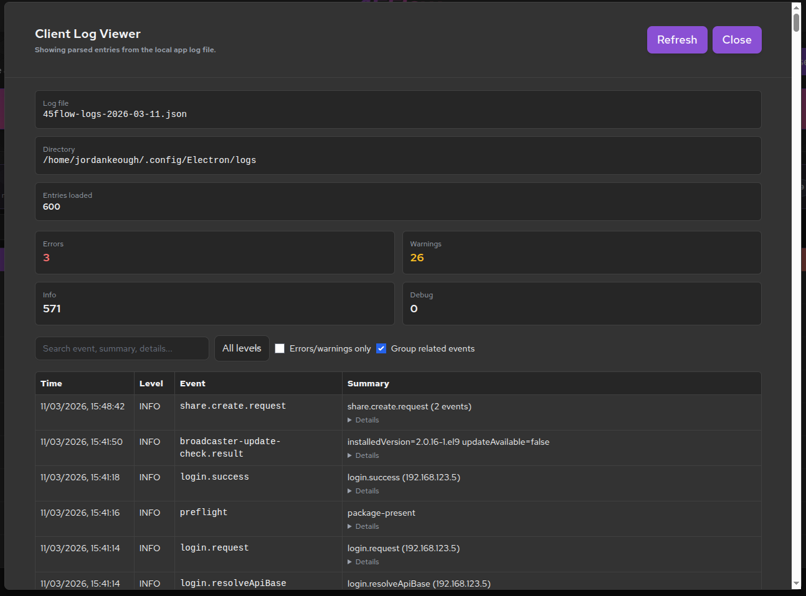

### Log Summary

At the top, you'll see:

- **Log file** — The name of the currently loaded log file (e.g., `45studio-share-client-2026-03-11.json`).
- **Directory** — The file path where logs are stored on your system.
- **Entries loaded** — Total number of parsed log entries.

**Severity counts** are shown as colored badges:
- 🔴 **Errors** — Failures, unhandled exceptions, critical issues
- 🟡 **Warnings** — Non-critical issues, network retries
- 🔵 **Info** — General operational events (uploads started, links created)
- ⚪ **Debug** — Low-level diagnostic data

### Searching & Filtering Logs

| Control | Description |
|---------|-------------|
| **Search** | Filter by event name, summary text, details, IP address, or actor. |
| **Level filter** | Show only a specific level: *All levels*, *Error*, *Warn*, *Info*, or *Debug*. |
| **Errors/warnings only** | Quick toggle to show only error and warning entries. |
| **Group related events** | Groups similar events together to reduce visual duplication during repeated failures. |

### Log Entry Details

Each log entry shows:

| Column | Description |
|--------|-------------|
| **Time** | Timestamp of the event. |
| **Level** | Severity: ERROR, WARN, INFO, or DEBUG. Error rows are highlighted in red, warnings in amber. |
| **Event** | Event identifier (e.g., `upload.started`, `link.created`, `sse.error`). |
| **Summary** | Human-readable description of what happened. |

Click on any entry to expand its **Details** section, which shows the full event payload and structured diagnostic information.

- Click **"Refresh"** to reload and re-parse the current log file.
- Click **"Close"** to return to the Dashboard.

> **Tip:** If you're experiencing connection or upload issues, check the logs for `ERROR` entries. The event names and summaries will help identify the cause.

---

## 18. Port Forwarding for External Sharing

To share files externally (over the internet), HTTPS port **443** (or your custom HTTPS port) must be forwarded from your router to your server.

**What is port forwarding?**  
Port forwarding tells your router to direct incoming traffic on a specific port to your server's local IP address, allowing people outside your network to access your share links.

**General Steps:**

1. Log into your router's admin panel (usually at `192.168.1.1` or `192.168.0.1`).
2. Find the **Port Forwarding** or **NAT** settings section.
3. Create a new rule:
   - **External port:** 443 (or your custom HTTPS port)
   - **Internal IP:** Your server's local IP address
   - **Internal port:** 443 (or your custom HTTPS port)
   - **Protocol:** TCP
4. Save the rule and test using the **"Check Port"** button in the 45Flow link creation screen.

> **Note:** Port forwarding configuration varies by router manufacturer and model. Some ISPs or shared building networks may restrict port forwarding. If you're unsure whether your network supports it, contact your ISP or network administrator.

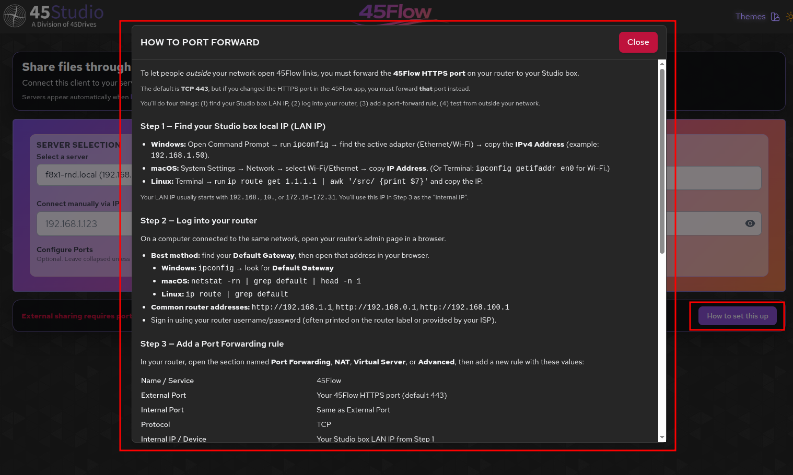

---

## 19. Frequently Asked Questions

**Q: My server doesn't appear in the auto-discovery dropdown. What do I do?**  
A: The `houston-broadcaster` service must be running on the server. Try connecting manually using the server's IP address via the **"Connect manually via IP"** field.

**Q: External share links aren't working. What should I check?**  
A: Ensure port 443 (or your custom HTTPS port) is forwarded on your router. Use the **"Check Port"** button when creating a link to verify. Also confirm your external URL is correctly configured in **Settings**.

**Q: What file types are supported for upload?**  
A: 45Flow supports a wide range of media file types including:
- **Video:** MP4, MOV, MKV, AVI, WebM, BRAW, R3D, and more
- **Image:** JPG, PNG, TIFF, EXR, DPX, PSD, and more
- **Audio:** MP3, WAV, FLAC, AAC, AIFF, and more
- **Cinema/VFX:** DPX, CIN, EXR, HDR, DNG, RAW camera formats
- **Archives:** ZIP, TAR, GZ, 7Z, RAR
- **Documents:** PDF, SRT, VTT (subtitles), XML, CSV

**Q: What do review copies do?**  
A: Review copies are lower-resolution versions (720p, 1080p) of your videos. When enabled, shared links stream the review copy instead of the original, resulting in faster playback, reduced bandwidth usage, and protection of your original high-resolution files.

**Q: Can I change a link's settings after creating it?**  
A: Yes. Open the link's **Details** from the Dashboard and click **"Edit"**. You can change access mode, password, expiration, review copy/watermark settings, and the files attached to the link. Changes take effect immediately.

**Q: What happens when a link expires?**  
A: Expired links become inaccessible to anyone who tries to open them. The link remains in your Dashboard with an "Expired" status, so you can view its history or adjust its expiration to reactivate it.

**Q: Can I disable a link without deleting it?**  
A: Yes. Click **"Disable"** in the link's action column on the Dashboard. This immediately blocks access. You can re-enable it later with the **"Enable"** button.

**Q: How are uploaded files scanned for security?**  
A: All uploaded files go through a quarantine process with malware scanning before being moved to the destination folder. Files that fail the scan are rejected.

**Q: Where are my logs stored?**  
A: Client logs are stored in your local application data directory (shown in the Log Viewer). They are not stored on the server.

---

*For additional support, contact your 45Drives representative or visit [45drives.com](https://www.45drives.com).*
